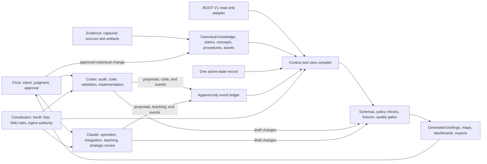

# ROOT V2 Master Design Report

## Executive decision

Build a small, separate successor laboratory called **ROOT-SEED**. Preserve
`.ROOT` as V1 evidence and the current operating environment. ROOT-SEED begins
with fixtures, then reads selected `.ROOT` material through a read-only adapter.
It earns the name ROOT V2 only after it outperforms V1 on a bounded real
workflow without creating a second source of truth.

**ROOT V2 is a Codex/Claude operating system, not a self-contained AI.** Codex
and Claude remain the external reasoning and execution surfaces. ROOT V2
provides the shared files, state, evidence, interfaces, deterministic tools,
permissions, and continuity they use. It does not host a model, train a model,
or run an independent autonomous intelligence.

The recommended first workflow is an **Education Readiness Brief** for one
upcoming school topic. This directly attacks Chris's three clearest problems:
starting the day, progressing the education system, and arriving at new
material without the prerequisites needed to participate.

This report defines what a correctly planned system could eventually do, the
minimum architecture required, the stages that prevent overbuilding, and the
exact decisions and participation required from Chris. It is an approval-stage
design. It does not authorize creating ROOT-SEED, changing `.ROOT`, migrating
knowledge, installing a new agent runtime, or changing governance.

## Evidence behind the decision

This design incorporates:

- the current `.ROOT` architecture and health findings;
- the six digital-garden reviews in this packet;
- `comparison-and-root-v2-deltas.md`;
- Claude's independent `support-with-changes` verdict in
  `claude-challenge-response.md`;
- the agent-operated runtime analysis in
  `07-primeintellect-prime-agent.md`;
- Chris's answers recorded in `claude-challenge-packet.md` and the comparison;
- the North Star and current governance boundaries.

The evidence does **not** show that Markdown, wikis, or accumulated knowledge
failed. It shows that V1 mixed several different concerns—knowledge, active
state, navigation, governance, intake, logs, plans, AI context, and generated
summaries—without first fixing a stable object model and authority model.

The successor therefore starts by separating those concerns, not by producing
a more attractive directory tree.

## Mission

ROOT V2 should become a human-controlled knowledge and execution system that
helps Chris:

1. determine the correct work to do now;
2. arrive prepared to learn unfamiliar material;
3. convert information into understanding and demonstrated capability;
4. connect school, technology, systems engineering, business, and prior work;
5. implement and verify useful changes;
6. convert repeated solutions into reusable intellectual property;
7. identify and improve valuable SMB workflows;
8. measure outcomes and develop realistic revenue-producing services;
9. allow AI agents to improve their methods without silently changing truth,
   authority, or purpose;
10. remain understandable, recoverable, and usable by Chris without depending
    on one model or application.

The operating thesis remains:

> Human sets intent → AI performs repeatable draft and compilation work → human
> validates exceptions and quality → the system records evidence and approved
> improvements.

## Non-goals

ROOT V2 is not intended to be:

- a self-contained AI, model host, or independent agent daemon;
- an autonomous company that acts without Chris;
- a universal collection of everything available online;
- a public digital garden by default;
- a second live copy of `.ROOT`;
- a hand-maintained map of every file;
- a chatbot transcript archive;
- a system where AI-generated text becomes fact by being saved;
- a platform that optimizes activity instead of outcomes;
- an excuse to delay schoolwork while building infrastructure;
- dependent on Prime Agent, Claude, Codex, Obsidian, or any single vendor.

## Design invariants

These rules should remain stable even when tools and folder names change.

1. **One authority per fact or state.** Generated views never become competing
   sources of truth.
2. **Evidence is not automatically fact.** Raw material proves what a source
   said or contained; a claim needs validation and provenance.
3. **Human-readable canonical storage.** Core knowledge and rules remain usable
   when automation is unavailable.
4. **Generated interaction layers.** Search indexes, dashboards, maps,
   briefings, and navigation are reproducible outputs.
5. **One active-state record.** “Now” cannot be independently maintained across
   several plans and dashboards.
6. **Learning ends in performance.** Reading, highlighting, and note creation
   are intermediate work, not proof of understanding.
7. **Changes leave evidence.** Important transitions record what changed, why,
   who approved it, and how it was tested.
8. **No silent self-modification.** AI proposes durable refinements; authority
   and impact determine approval requirements.
9. **Local-first and reversible.** Cloud services are optional interfaces, not
   the only copy of system truth.
10. **Economic claims require measured outcomes.** A useful idea is not yet a
    product, client result, or revenue capability.

## What ROOT V2 can eventually do

The following is the capability ceiling if the system is built and validated
in stages. These are not all Stage 1 features.

### 1. Intent and daily operating control

ROOT V2 can:

- accept Chris's intent in plain language;
- identify the governing priority and relevant constraints;
- reconcile the request with school, deadlines, active commitments, and the
  North Star;
- compile a small “correct next action” briefing;
- show why each source or instruction was included;
- distinguish required work, optional work, blocked work, and deferred ideas;
- update one canonical active-state record after Chris confirms the result;
- generate morning, evening, weekly, and project views from that state;
- detect stale plans or conflicting active instructions;
- preserve after-hours work instead of excluding it through a fixed clock
  window.

**Proof required:** the briefing reaches the correct action faster than the V1
manual path and never omits a controlling instruction in the test set.

### 2. Education readiness and instruction

ROOT V2 can:

- identify the topic, expected learning outcome, and place in the course map;
- build a prerequisite graph before instruction begins;
- compare required prerequisites with Chris's demonstrated state;
- distinguish unknown, rusty, familiar, and demonstrated knowledge;
- create a minimum refresh path rather than reteaching everything;
- explain the system-level picture before details;
- teach with plain language, machinery/workflow analogies, diagrams, examples,
  and guided construction;
- request Chris's attempt before presenting the final solution where learning
  requires independent performance;
- diagnose the error type and update the next practice action;
- schedule retrieval and transfer practice from evidence, not arbitrary volume;
- respect course AI restrictions and keep prohibited graded work human-owned;
- connect course learning to Python, systems engineering, operations, business,
  and earlier concepts without turning every lesson into a business project.

**Proof required:** Chris can explain, perform, and transfer the concept under
the agreed rubric—not merely recognize the answer.

### 3. Knowledge acquisition and research

ROOT V2 can:

- capture a source without pretending it has been understood;
- record authorship, URL/path, date, authority, scope, and privacy;
- extract claims, concepts, procedures, examples, and open questions;
- distinguish quotation, observation, inference, hypothesis, and verified
  claim;
- detect contradictory claims and retain the disagreement;
- show when a claim was last checked and what could make it stale;
- identify missing primary sources;
- compile a research brief around a decision instead of a topic pile;
- prevent duplicate captures from becoming duplicate “truths”;
- preserve immutable evidence while allowing interpretations to evolve;
- produce source-linked summaries and decision records;
- route new knowledge into the correct owner without requiring Chris to know
  the directory structure.

**Proof required:** a fixed question set retrieves the authoritative source,
claim status, and provenance accurately at least 95% of the time.

### 4. Knowledge relationships and unknown-space mapping

ROOT V2 can:

- connect knowledge through explicit edge types;
- show prerequisites, dependencies, applications, contradictions, evidence,
  supersession, and produced outcomes;
- display where a new concept fits in the known system;
- reveal disconnected notes, unsupported claims, missing prerequisite chains,
  and areas with evidence but no interpretation;
- distinguish an unknown topic from an unknown relationship;
- generate maps for a task or learner instead of maintaining one universal
  graph manually;
- identify high-leverage bridge concepts that unlock several downstream areas.

**Proof required:** generated maps help answer a defined question or select an
action; number of links alone is never a success metric.

### 5. Implementation and project execution

ROOT V2 can:

- convert a verified concept or decision into an implementation brief;
- define desired outcome, owner, inputs, dependencies, risks, tests, rollback,
  and completion criteria;
- decompose work into bounded tasks without losing the parent objective;
- coordinate specialized AI agents with scoped context;
- preserve progress across sessions and model changes;
- distinguish planning, execution, validation, and completion;
- run deterministic checks before claiming success;
- retain failed attempts and lessons without cluttering current instructions;
- produce exact handoffs when Chris switches devices, models, or days;
- turn repeated procedures into reviewed skills, checklists, templates, or
  scripts.

**Proof required:** an implementation is complete only when the artifact exists,
the relevant checks pass, and the intended human outcome is verified.

### 6. Controlled Codex/Claude-assisted system improvement

Codex and Claude, operating through ROOT V2, can:

- observe recurring failures, repeated corrections, and successful patterns;
- propose a small refinement to instructions, retrieval, schema, validation,
  or automation;
- attach evidence and expected benefit to the proposal;
- estimate affected files, processes, and users;
- test the proposal on fixtures or historical cases;
- require Chris's approval for constitutional, structural, security, privacy,
  or cross-domain changes;
- version accepted refinements and retain a rollback pointer;
- measure whether the refinement actually improved the target;
- retire ineffective rules instead of accumulating permanent instructions;
- promote a recurring method into an executable skill only after review.

The refinement sequence is:

`observation -> evidence -> proposal -> impact review -> test -> approval ->`
`versioned change -> measurement -> retain or roll back`

ROOT V2 records, constrains, tests, and versions this process. The intelligence
performing the review is Codex or Claude; the system does not originate an
independent AI judgment or silently rewrite itself.

**Proof required:** every durable change is traceable to evidence, approval
authority, tests, and a reversible version.

### 7. SMB workflow discovery and optimization

ROOT V2 can:

- build a general model of how businesses create and deliver value;
- study operations, supply chains, information flows, handoffs, decisions, and
  control points;
- map an observed workflow from trigger to outcome;
- establish a baseline before recommending automation;
- identify waiting, rework, defects, excessive handoffs, unclear ownership,
  duplication, and information loss;
- determine whether the problem requires elimination, standardization,
  integration, automation, or training;
- create a small intervention and validation plan;
- measure cycle time, labor minutes, errors, rework, wait time, throughput,
  adoption, and dollar impact where appropriate;
- capture exceptions that still require human judgment;
- convert validated methods into audit frameworks, implementation playbooks,
  training materials, templates, and service components;
- maintain a library of evidence-backed operational patterns by business type;
- connect school and technical learning to business capability when a real
  relationship exists.

**Proof required:** an optimization claim includes a baseline, intervention,
validation, measured outcome, and named beneficiary.

### 8. Economic-value development

ROOT V2 can:

- distinguish an interesting capability from a marketable deliverable;
- associate research and methods with a defined client problem;
- maintain hypotheses about buyer, pain, current workaround, measurable value,
  and willingness to act;
- identify which internal methods are mature enough to package;
- assemble evidence for a case study without exposing private material;
- generate drafts of audit scopes, proposals, implementation plans, and client
  training from approved reusable assets;
- track assumptions that still require interviews or market evidence;
- compare opportunities by fit, proof, effort, risk, and potential outcome;
- record why an opportunity was pursued, deferred, or rejected;
- learn from delivery exceptions and improve the reusable method.

**Proof required:** revenue potential is not claimed until there is a defined
problem, buyer, deliverable, measurable outcome, and evidence of demand.

### 9. Agent coordination and continuity

ROOT V2 can:

- route work to the correct AI surface or specialized agent;
- compile only the context needed for each task;
- prevent a child agent from inheriting unnecessary sensitive context;
- retain objectives, decisions, open questions, evidence, and next actions
  across compaction and handoff;
- distinguish a continuing goal from a completed task;
- impose time, token, action, and permission budgets;
- require quality gates before autonomous continuation can finish;
- stop or escalate when authority, safety, or product judgment is missing;
- compare model output against deterministic tests and human validation;
- keep model-specific memory supplemental to canonical system state.

**Proof required:** a handoff can resume correctly from canonical state without
requiring the full prior transcript.

### 10. Privacy, security, and publishing

ROOT V2 can:

- classify material as private, internal, client-confidential, or public;
- prevent generated views from crossing privacy boundaries;
- give tools the minimum required filesystem and network permissions;
- treat executable skills and imported instructions as code requiring review;
- preserve immutable source evidence;
- maintain backups, integrity checks, and recovery instructions;
- produce sanitized public or client-facing artifacts from approved canonical
  material;
- record which source claims are safe to reuse externally;
- support desktop and laptop authoring while providing a later read-oriented
  interface for iPad;
- keep the private repository as a versioned backup without making GitHub the
  runtime authority.

**Proof required:** access and publication tests demonstrate that restricted
fixtures never appear in a lower-classification output.

### 11. Measurement and system observability

ROOT V2 can:

- record events without rewriting large logs;
- measure time-to-ready, time-to-correct-action, retrieval precision, missed
  prerequisites, successful transfers, manual interventions, and exceptions;
- distinguish actual work completion from clock-window assumptions;
- show why an automated decision occurred;
- detect stale sources, broken dependencies, failed compilers, and conflicting
  state;
- report which metrics are directly observed, inferred, or unavailable;
- prevent “more notes,” “more links,” or “more agent turns” from becoming vanity
  success metrics.

**Proof required:** every headline metric has a definition, source event,
measurement window, and known limitations.

## High-level architecture



## Authority and storage model

| Layer | Purpose | Canonical? | Typical format | Who may change it |
|---|---|---:|---|---|
| Constitution | Purpose, knowledge rules, permissions | Yes | Markdown/YAML | Chris-approved changes |
| Evidence | Preserve received source or artifact | Yes for capture | Original file + metadata | Chris intake; AI read-only by default |
| Knowledge | Current interpreted claims and methods | Yes | Markdown/YAML | AI drafts; approval by impact |
| Active state | Current objective, commitments, blockers | Yes | YAML or JSON | Controlled state transition |
| Events | What happened and evidence pointers | Yes | JSONL | Append-only through validated interface |
| Index | Search and relationship retrieval | No | SQLite | Compiler only; rebuildable |
| Views | Human/agent interfaces | No | Markdown/HTML/JSON | Compiler only; rebuildable |
| Session memory | Temporary agent continuity | No | Provider/runtime artifacts | Runtime; never primary authority |

## Canonical knowledge model

Every canonical knowledge item should have a stable identity and a small common
schema. Not every field must be displayed prominently.

```yaml
id: stable-slug-or-id
type: source | claim | concept | procedure | project | experiment | outcome | asset
title: human-readable title
domain: education | technology | systems | business | personal-operations
status: captured | understood | tested | proven | packaged | retired
claim_state: observed | inferred | corroborated | verified | contested | not-applicable
confidence: low | medium | high
privacy: private | internal | client-confidential | public
sources: []
relationships: []
proof: []
created: YYYY-MM-DD
updated: YYYY-MM-DD
check_at: YYYY-MM-DD or event
```

The schema must distinguish two independent questions:

- **Maturity:** how far the item has traveled toward demonstrated use.
- **Truth status:** how strongly a particular claim is supported.

A well-understood hypothesis can still be unverified. A verified fact may not
yet have been applied or packaged.

### Required relationship types

- `supports`
- `contradicts`
- `depends-on`
- `prerequisite-for`
- `connects-to`
- `applies-to`
- `derived-from`
- `produces`
- `supersedes`
- `tested-by`

Additional relationship types require evidence that the existing set cannot
express a real need.

## Fact and evidence policy

The new system should use these definitions:

- **Evidence:** preserved material showing what was observed, received, run, or
  stated. Evidence can be wrong, incomplete, deceptive, or outdated.
- **Claim:** a falsifiable or supportable statement extracted from evidence or
  reasoning.
- **Fact:** a claim currently accepted as verified within a stated scope,
  supported by appropriate authority or direct validation, with provenance and
  a date or condition for rechecking.
- **Inference:** a conclusion derived from evidence that is not itself directly
  observed.
- **Hypothesis:** a claim deliberately awaiting testing.

Placing a file in `raw/` or `evidence/` means “preserve this source,” not “treat
every statement inside it as true.” This prevents an article, screenshot, or AI
output from becoming authoritative merely through location.

## Minimal initial folder structure

ROOT-SEED should begin with the smallest structure capable of expressing the
architecture:

```text
ROOT-SEED/
├── README.md
├── NORTH_STAR.md
├── WIKI.md
├── AI_OPERATING_CONTRACT.md
├── AGENTS.md
├── CLAUDE.md
├── wiki/
├── evidence/
├── state/
│   └── ACTIVE.yaml
├── events/
│   └── ledger.jsonl
├── runtime/
├── views/
└── tests/
    └── fixtures/
```

`AI_OPERATING_CONTRACT.md` is the canonical shared contract. `AGENTS.md` is a
thin Codex loader and `CLAUDE.md` is a thin Claude loader. They contain only the
surface-specific instructions needed to load the shared contract and use that
surface safely. Shared rules must not be duplicated between the loaders.

### Folder responsibilities

- `wiki/` — canonical interpreted knowledge. Begin nearly flat; metadata and
  relationships carry meaning. Add subfolders only after repeated ownership or
  scale evidence.
- `evidence/` — preserved sources and artifacts. AI is read-only by default.
- `state/` — one authoritative active-state record and its schema.
- `events/` — append-only facts about actions, validations, and transitions.
- `runtime/` — deterministic compiler, search index builder, validators, and
  adapters invoked by Codex, Claude, or Chris. It contains no language model.
- `views/` — entirely generated briefings, maps, dashboards, and exports.
- `tests/fixtures/` — synthetic and copied non-sensitive cases used to prove
  behavior before touching live material.

Do not create domain wikis, logs, dashboards, archives, project trees, skill
libraries, or device-sync infrastructure at the beginning. They must emerge
from a proven workflow.

## Core operating workflows

### Intake workflow

`capture -> identify source -> classify privacy -> preserve evidence -> extract`
`claims/concepts/procedures -> link -> validate -> update index -> select next action`

### Teaching workflow

`intent -> outcome -> prerequisite map -> readiness check -> minimum refresh ->`
`system map -> explanation -> worked example -> Chris attempt -> feedback ->`
`proof -> transfer -> update learning state`

### Research workflow

`decision question -> known claims -> gaps -> source plan -> capture -> extract ->`
`compare -> contradiction review -> conclusion -> confidence -> decision or next test`

### Workflow-optimization workflow

`user/problem -> current workflow -> baseline -> failure mode -> intervention ->`
`implementation -> validation -> measured outcome -> exceptions -> reusable method -> offer hypothesis`

### System-refinement workflow

`recurring evidence -> proposal -> affected interfaces -> fixture test -> approval ->`
`versioned change -> live observation -> retain or rollback`

### Session workflow

`objective -> compiled context -> work -> validation -> event -> active-state transition ->`
`generated view -> exact next action or complete handoff`

## AI authority matrix

| Action | Default authority |
|---|---|
| Read approved canonical knowledge | Allowed within task scope |
| Read private journal material | Prohibited |
| Read evidence needed for a task | Allowed when privacy and scope permit |
| Modify original evidence/raw material | Prohibited |
| Generate a disposable view | Allowed |
| Append a validated low-risk event | Allowed through the event interface |
| Draft a knowledge update | Allowed |
| Promote a claim to verified fact | Requires validation rule; material cases require Chris |
| Change active state | Controlled transition with visible evidence |
| Create or modify executable skill | Review and test required |
| Change North Star, permissions, privacy, or schema | Chris approval required |
| Move or migrate canonical knowledge | Chris approval required |
| Publish, message, purchase, deploy, or expose data | Explicit approval required |
| Refine supplemental agent memory | Proposed, scoped, tested, versioned, reversible |

## Technical foundation

Use the smallest boring stack that satisfies the design:

- Markdown for human-readable rules and knowledge;
- YAML frontmatter for shared metadata;
- JSONL for append-only events;
- SQLite with full-text search for a rebuildable local index;
- Python for validation, compilation, and adapters;
- Git for version history, review, comparison, and rollback;
- a private remote repository only after local behavior is stable;
- generated Markdown first; HTML or an application interface only when a real
  human-use problem requires it.

Do not begin with a graph database, vector database, home-network server,
multi-agent daemon, cloud deployment, or autonomous self-improving runtime.
Typed relationships can initially live in Markdown metadata and be compiled
into SQLite. More infrastructure requires measured failure of the simple stack.

## Device strategy

### Initial

- Desktop is the authoritative working environment.
- Git provides versioning and recovery.
- Laptop access waits until repository and credential rules are tested.
- iPad is read-only or minimal interaction through generated views.

### Later

Use a private Git remote for desktop/laptop synchronization. Select an iPad
interface only after the required actions are known. Do not establish a home
server or Google Drive synchronization layer during the kernel pilot; either
could create file conflicts or an additional authority surface.

## Staged implementation plan

Stages are governed by exit evidence, not calendar optimism.

### Stage 0 — Constitution and measurement specification

**Build:** no runtime and no new repository yet. Finalize the proposed North
Star, `WIKI.md`, shared `AI_OPERATING_CONTRACT.md`, thin `AGENTS.md` and
`CLAUDE.md` loaders, schemas, pilot definition, baseline procedure, and
acceptance tests in the current evidence packet.

**Chris provides:** approval or corrections to the product decisions listed
later in this report.

**Exit gate:** the purpose, object model, authority boundaries, first workflow,
and success measures are unambiguous enough that two agents independently
describe the same system.

### Stage 1 — Fixture-only knowledge kernel

**Build:** create `ROOT-SEED` as a separate Git repository. Add the three
canonical constitutional files, two thin model-specific loaders, minimal
directories, schemas, validator, event writer, and a few
synthetic/non-sensitive learning fixtures.

**Do not build:** `.ROOT` import, migration, web UI, multi-device sync, business
engine, autonomous refinement, or multi-agent orchestration.

**Exit gate:** canonical files validate, generated views are reproducible,
evidence cannot be modified through the runtime, and every output links back to
its sources.

### Stage 2 — Education Readiness pilot

**Build:** model one upcoming school learning outcome, its prerequisites, a
readiness check, and a generated briefing. Run the V1 manual path and ROOT-SEED
path side by side.

**Chris provides:** honest readiness responses, performs the attempt, validates
whether the briefing was usable, and records corrections.

**Exit gate:** no missed controlling instruction, missing prerequisites are
found earlier, the correct starting action is clear, and time-to-ready improves
against the measured baseline.

### Stage 3 — Read-only `.ROOT` adapter

**Build:** allowlist a small set of `.ROOT` paths and compile them into the same
pilot view. Record why each file was selected. Never write back.

**Exit gate:** the adapter handles conflicts, stale sources, and provenance
without treating V1 layout as the V2 schema. Removing the generated index and
rebuilding it produces the same result.

### Stage 4 — One-domain canonical trial

**Build:** after explicit approval, choose one bounded capability whose new
canonical records live in ROOT-SEED. Make the corresponding V1 capability
read-only; never dual-write.

**Exit gate:** the capability works across several real sessions, survives
handoff/recovery, and has lower human maintenance than V1.

### Stage 5 — Controlled cross-model refinement and reusable skills

**Build:** Codex/Claude refinement proposals, independent cross-model challenge
when warranted, impact reports, versioned supplemental rules, fixture
evaluations, and reviewed skill packaging. ROOT V2 records and tests the
process; it does not originate independent AI judgment.

**Exit gate:** at least one recurring failure is improved without governance
drift, hidden authority, or regression on prior fixtures.

### Stage 6 — Workflow and economic-value loop

**Build:** one real workflow analysis from baseline through measured result and
reusable asset. Start with internal/student operations or a non-sensitive
simulated SMB case before client data.

**Exit gate:** the system produces an evidence-backed method and deliverable,
not just research notes. Any revenue hypothesis names the user, problem,
outcome, and validation still required.

### Stage 7 — Promotion decision

Compare total results and maintenance burden. Promote ROOT-SEED to ROOT V2 only
if it passes the agreed gates across time. Otherwise retain the proven pieces,
revise the design, or stop.

## V1-to-V2 migration policy

Migration is a selection and interpretation process, not a file copy.

1. Preserve a recoverable V1 checkpoint.
2. Inventory candidate material without changing it.
3. Classify each item as evidence, canonical knowledge, active state,
   instruction, generated view, historical log, dependency, or obsolete draft.
4. Resolve authority and conflicts before importing.
5. Import only what a proven V2 workflow needs.
6. Validate links, provenance, privacy, and schema.
7. Make the corresponding V1 function read-only before V2 becomes canonical.
8. Record the decision and rollback point.
9. Expand by capability, not top-level folder.
10. Archive V1 only after V2 repeatedly succeeds and Chris explicitly approves.

At no point should both systems accept live canonical writes for the same
concept or state.

## Baselines and success gates

### First pilot measurements

Before optimization, observe several V1 sessions and record:

- time from beginning the session to identifying the correct action;
- time from beginning preparation to starting meaningful learning;
- number of prerequisites discovered before instruction;
- number discovered too late during instruction;
- number of sources opened and proportion actually useful;
- controlling instructions missed or contradicted;
- corrections Chris must make to the generated briefing;
- result of the agreed understanding test;
- work performed at any hour, based on evidence rather than a 9–5 window.

### Candidate pilot gates

- At least 50% reduction in median time-to-ready after a fair baseline window.
- Zero omitted controlling instructions in the fixed fixture set.
- At least 50% reduction in irrelevant context loaded.
- At least 95% correct source/provenance retrieval on the fixed question set.
- Prerequisite gaps identified before instruction rather than after failure.
- One demonstrated transfer task per selected learning unit.
- One active-state authority.
- Zero automatic writes to `.ROOT`.
- Zero new health-gate blocker.

“100% more effective” must always be attached to a named measure. Halving time
or doubling verified outputs can be measured; declaring the whole system “100%
better” cannot.

## Exact information and decisions required from Chris

Chris should not be asked to design schemas, databases, compilers, or folder
mechanics. Those are implementation responsibilities. Chris is required where
purpose, lived usability, truth, privacy, or authority cannot be inferred.

### Required before Stage 1

| Decision | Recommended default | What Chris must provide |
|---|---|---|
| North Star | Education-first knowledge-to-value operating system | Approve, reject, or correct one concise statement |
| First user | Chris only | Confirm |
| First workflow | Education Readiness Brief for the next real school topic | Confirm the workflow and name the first topic when ready |
| Primary environment | Windows desktop, local-first | Confirm |
| Initial repository | `C:\Users\chris\ROOT-SEED`, separate private Git repository | Approve exact location/name |
| Fact policy | Raw/evidence is preserved source; facts require verified claims and provenance | Explicitly approve or correct |
| Privacy default | Private unless deliberately downgraded | Confirm |
| Codex/Claude constitutional authority | Either may propose; Chris approves purpose, permissions, structure, privacy, and migrations | Confirm |
| Migration rule | No bulk copy and no dual canonical writes | Confirm |
| School restriction rule | Course policy overrides automation convenience | Confirm |

### Required to define “understood”

Chris does not need one universal philosophical definition. For each learning
unit, select the relevant observable proof from a standard rubric:

1. explain the concept in plain language;
2. identify its parts and relationships;
3. solve or perform a representative task without copying;
4. diagnose a plausible error;
5. apply the concept in a changed context;
6. connect it accurately to a prior or downstream concept.

**Recommended default:** a concept is “demonstrated” when Chris can explain it,
perform one representative task, and transfer it to one changed case. High-risk
or foundational concepts may require additional proof.

Chris must tell the system when the rubric feels misleading, too easy, or
misaligned with the course. The system should adapt the rubric through an
approved rule, not silently lower the standard.

### Required during the pilot

Chris must:

- state the actual learning objective or provide the controlling course source;
- answer the readiness check honestly without trying to satisfy the system;
- perform the learner-owned attempt;
- say whether the next action was clear and practically usable;
- identify important missing or unnecessary information;
- validate whether completion evidence reflects real understanding;
- approve any proposed durable correction.

The expected burden should be small: a few minutes of intent and readiness
input, the actual learning attempt, and a short validation afterward.

### Required at later gates

Chris must explicitly approve:

- connecting live `.ROOT` paths;
- creating ROOT-SEED outside the governed vault;
- changing canonical ownership for any capability;
- enabling writes or automation beyond generated views/events;
- installing or executing third-party agent runtimes or skills;
- syncing private material to a remote service;
- publishing or exposing any artifact;
- using client-confidential data;
- promoting ROOT-SEED to ROOT V2;
- archiving any V1 capability or file.

### Information Chris does not need to provide now

Chris does not need to decide:

- the final top-level folder tree;
- whether a graph database will ever be used;
- which AI model will be permanent;
- the eventual public website design;
- the complete SMB service offering;
- the final device-sync system;
- how every current `.ROOT` file will migrate;
- every future domain or relationship type.

Those decisions should be delayed until actual use supplies evidence.

## Proposed concise North Star for review

> ROOT V2 is Chris's private, human-controlled knowledge and execution system.
> It prepares him to learn and earn, turns verified knowledge into demonstrated
> capability, connects that capability to real operational problems, and
> converts repeated successful methods into measurable value and reusable
> economic assets. Codex and Claude may compile, draft, teach, test, and propose
> improvements through the shared operating contract; Chris
> retains authority over purpose, truth, privacy, consequential action, and
> structural change.

### Fixed priority order

1. Active schoolwork and education.
2. Technical capability supporting school, the system, or the solo business.
3. AI-assisted workflow improvement and systems-integration capability.
4. Reusable business assets and evidence-backed market learning.
5. Other expansion only when deliberately activated.

## Principal risks and controls

| Risk | Consequence | Control |
|---|---|---|
| Recreating V1 complexity | New system becomes another maintenance project | Stage gates; minimal initial tree; no speculative folders |
| Premature migration | Lost context and conflicting truth | Read-only adapter; capability-by-capability promotion |
| AI self-modification drift | Rules optimize locally and corrupt purpose | Immutable constitution; proposals, approval, tests, rollback |
| Raw treated as fact | Unverified material becomes authoritative | Separate evidence and claim status |
| Generated views become canonical | Hidden second system | Disposable output directories and deterministic rebuilds |
| Model/vendor dependency | System becomes unusable when tools change | Markdown, SQLite, Python, Git, documented interfaces |
| Context compiler omission | Agent misses controlling instruction | Fixed fixtures, inclusion reasons, fail-closed tests |
| Metric gaming | Activity appears successful without value | Observable outcome definitions and human validation |
| Infrastructure distraction | School and learning lose priority | Education pilot first; later capabilities gated |
| Full-permission agent runtime | Damage to private or immutable material | Sandbox/allowlist; no Prime Agent on live vault |
| Cross-device conflicts | Duplicate or overwritten canonical state | Desktop-first; versioned sync only after pilot |
| Endless research | Design never reaches falsifiable use | Stop trend browsing unless tied to a named design question |

## What should be revisited as the system grows

Revisit only when evidence triggers the question:

- subfolder structure inside `wiki/` when scale or ownership makes the flat
  model materially painful;
- embeddings/vector retrieval when full-text and explicit relations fail a
  defined retrieval test;
- graph database when compiled relationships exceed SQLite's practical needs;
- multi-agent background runtime when bounded Codex/Claude workflows cannot
  meet a demonstrated continuity requirement;
- desktop/laptop/iPad interfaces when the exact required actions are observed;
- client data isolation before any real external engagement;
- public publishing only after privacy and reuse policies are proven;
- home server only when local availability or automation has a measured need.

## Review checklist for Chris

Chris can review this report by answering only these ten approval questions:

1. Does the proposed North Star describe the dream accurately enough to govern
   early decisions?
  **It is for sure a good start, I like it**
2. Is school correctly protected as the first operating priority?
  **Seemingly so, and I do think we should start small, not sure how small but python and physics wiki's should be first, in my opinion.**
3. Do you approve “evidence is preserved source; fact is a verified claim”?
  **yes that sounds right to me**
1. Do you approve the Education Readiness Brief as the first workflow?
  **I would need to review exactly what that it but we do need similar yes.***
1. Do you approve the recommended understanding proof: explain, perform, and
   transfer?
 **YES**
1. Do you approve a separate `C:\Users\chris\ROOT-SEED` private repository?
  **YES**
1. Do you approve fixture-only operation before connecting `.ROOT`?
  **YES**
1. Do you approve read-only `.ROOT` access before any migration or write access?
  **YES**
1.  Do you approve no bulk copy and no dual canonical writes?
  **YES with exceptions to things inside raw folders, those can be copied and moved when needed.**
1.  Do you approve AI proposing improvements while Chris retains authority over
    constitution, truth, privacy, structure, and consequential action?
 **YES, should always be recommending improvements you may see**

Corrections should name the question number and the desired change. Silence or
general enthusiasm is not structural approval.

## Recommended next action after approval

If Chris approves the ten decisions or supplies corrections:

1. Write the final Stage 0 ADR.
2. Draft exact `NORTH_STAR.md`, `WIKI.md`, `AI_OPERATING_CONTRACT.md`,
   `AGENTS.md`, and `CLAUDE.md` contents in this packet.
3. Ask Chris for one final structural approval showing the proposed paths and
   files.
4. Create `C:\Users\chris\ROOT-SEED` as a separate local Git repository.
5. Implement only the fixture validator, event interface, and Education
   Readiness Brief prototype.
6. Measure V1 before claiming improvement.

No other folders, migrations, integrations, or agent runtimes are part of the
first implementation slice.
